# Portfolio Website - Technical Architecture Documentation

## 🎯 Project Overview

This documentation provides a comprehensive analysis of Yohann Hommet's personal portfolio website - a sophisticated static site that demonstrates modern web development best practices using vanilla technologies enhanced with contemporary tooling and optimization strategies.

### Project Goals
- **Performance First**: Sub-second load times with optimal Core Web Vitals
- **Accessibility Driven**: WCAG 2.1 AA compliance with semantic HTML and ARIA
- **SEO Optimized**: Comprehensive meta tags, structured data, and social sharing
- **Progressive Enhancement**: PWA capabilities with offline support
- **Security Focused**: Content Security Policy and security headers
- **Developer Experience**: Modern build pipeline with live reloading and optimization

---

## 🏗️ System Architecture Overview

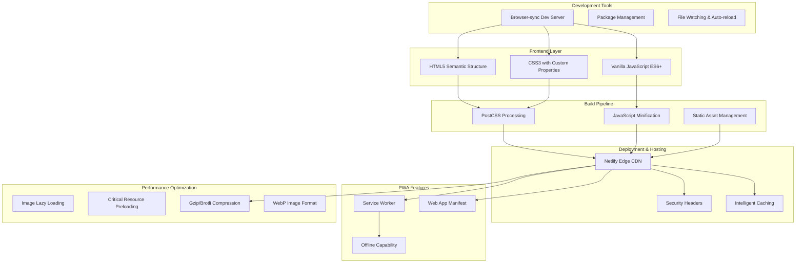

---

## 📁 Project Structure Analysis

```mermaid
graph TD
    Root[Portfolio Project Root]
    
    Root --> Assets[assets/]
    Root --> Config[Configuration Files]
    Root --> Pages[HTML Pages]
    Root --> Deploy[Deployment Files]
    
    Assets --> Documents[documents/ - PDF Resume]
    Assets --> Favicon[favicon/ - PWA Icons]
    Assets --> Images[img/ - Project Screenshots]
    Assets --> Scripts[js/ - JavaScript Modules]
    Assets --> Styles[style/ - CSS Architecture]
    Assets --> SVG[svg/ - Vector Graphics]
    
    Styles --> Base[base/ - Variables & Reset]
    Styles --> Components[components/ - UI Components]
    Styles --> Layout[layout/ - Structural Styles]
    Styles --> Sections[sections/ - Page-specific Styles]
    
    Scripts --> MainScript[script.js - Core Functionality]
    Scripts --> ServiceWorkerScript[service-worker.js - PWA Logic]
    
    Config --> PackageJSON[package.json - Dependencies]
    Config --> PostCSSConfig[postcss.config.js - Build Setup]
    Config --> NetlifyConfig[netlify.toml - Deployment Config]
    
    Pages --> IndexHTML[index.html - Main Page]
    Pages --> OfflineHTML[offline.html - PWA Fallback]
    
    Deploy --> WebManifest[site.webmanifest - PWA Manifest]
    Deploy --> Robots[robots.txt - SEO Crawling]
    Deploy --> Sitemap[sitemap.xml - Search Engine Map]
    
    Base --> Variables[_variables.css - Design Tokens]
    Base --> Reset[_reset.css - Normalize Styles]
    
    Components --> Buttons[_buttons.css - Button Variants]
    Components --> Cards[_cards.css - Card Components]
    Components --> Social[_social.css - Social Icons]
    Components --> Notifications[_notifications.css - Toast Messages]
    Components --> Animations[_animation.css - Motion Design]
    Components --> Accessibility[_accessibility.css - A11y Utilities]
    Components --> Utilities[_utilities.css - Helper Classes]
    
    Layout --> Navbar[_navbar.css - Navigation]
    Layout --> Footer[_footer.css - Site Footer]
    
    Sections --> Hero[_hero.css - Landing Section]
    Sections --> About[_about.css - Skills & Bio]
    Sections --> Projects[_projects.css - Portfolio Grid]
    Sections --> Contact[_contact.css - Contact Form]
```

---

## ⚙️ Build Process Workflow

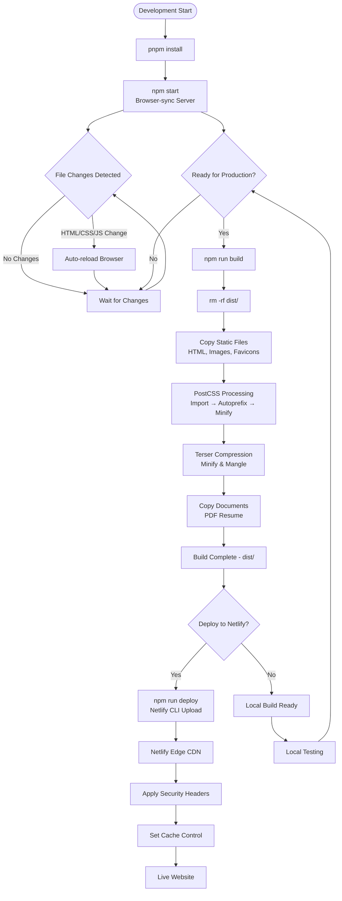

---

## 🎨 CSS Architecture Pattern

```mermaid
graph LR
    MainCSS[styles.css<br/>Entry Point]
    
    MainCSS --> BaseLayer[Base Layer]
    MainCSS --> ComponentLayer[Component Layer]
    MainCSS --> LayoutLayer[Layout Layer]
    MainCSS --> SectionLayer[Section Layer]
    
    BaseLayer --> Variables[_variables.css<br/>Design Tokens<br/>Theme Variables]
    BaseLayer --> Reset[_reset.css<br/>CSS Normalize<br/>Base Styles]
    
    ComponentLayer --> Buttons[_buttons.css<br/>Button Variants<br/>Interactive States]
    ComponentLayer --> Cards[_cards.css<br/>Project Cards<br/>Skill Cards]
    ComponentLayer --> Social[_social.css<br/>Social Icons<br/>Hover Effects]
    ComponentLayer --> Notifications[_notifications.css<br/>Toast Messages<br/>Success/Error States]
    ComponentLayer --> Animations[_animation.css<br/>Scroll Animations<br/>Transitions]
    ComponentLayer --> A11y[_accessibility.css<br/>Screen Reader<br/>Focus States]
    ComponentLayer --> Utils[_utilities.css<br/>Helper Classes<br/>Spacing/Typography]
    
    LayoutLayer --> Navbar[_navbar.css<br/>Navigation<br/>Mobile Menu]
    LayoutLayer --> Footer[_footer.css<br/>Site Footer<br/>Links]
    
    SectionLayer --> Hero[_hero.css<br/>Landing Section<br/>CTA Buttons]
    SectionLayer --> About[_about.css<br/>Skills Grid<br/>Biography]
    SectionLayer --> Projects[_projects.css<br/>Portfolio Grid<br/>Project Cards]
    SectionLayer --> Contact[_contact.css<br/>Contact Form<br/>Validation Styles]
    
    Variables --> ThemeLight[Light Theme<br/>CSS Custom Properties]
    Variables --> ThemeDark[Dark Theme<br/>data-theme="dark"]
```

---

## 🔄 User Interaction Flow

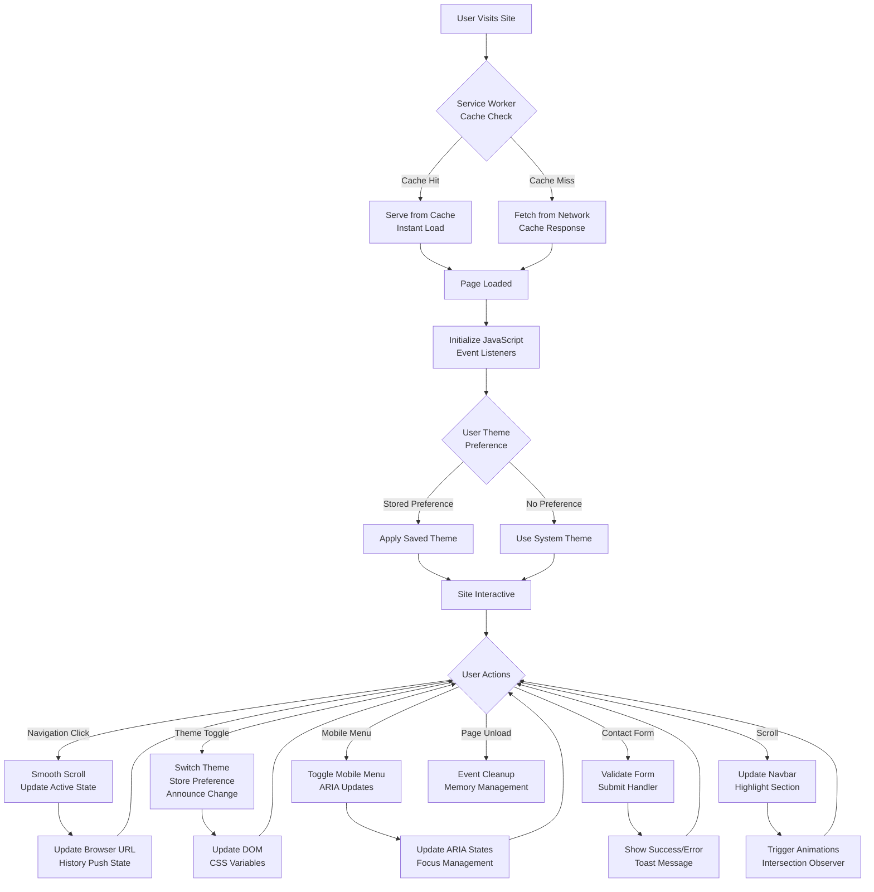

---

## 🚀 Feature Implementation Matrix

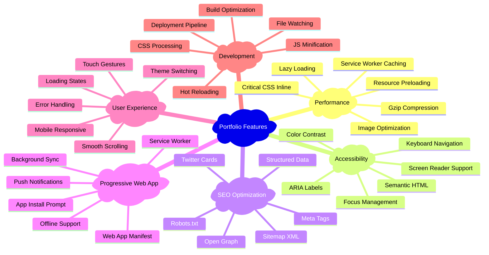

---

## 🛠️ Technology Stack Deep Dive

### Frontend Technologies

| Technology | Purpose | Implementation Details |
|------------|---------|----------------------|
| **HTML5** | Structure & Semantics | Semantic elements, ARIA labels, microdata |
| **CSS3** | Styling & Layout | Custom properties, Grid, Flexbox, animations |
| **JavaScript ES6+** | Interactivity | Modules, async/await, intersection observer |
| **Web APIs** | Modern Capabilities | Service Worker, Web App Manifest, localStorage |

### Build & Development Tools

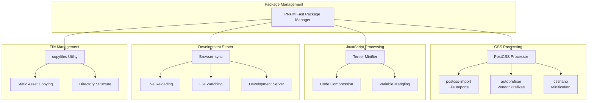

---

## 🔒 Security Implementation

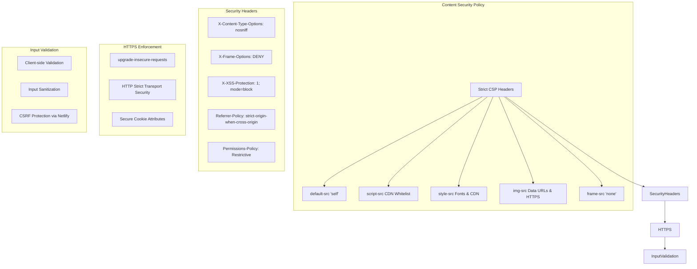

---

## 📊 Performance Optimization Strategy

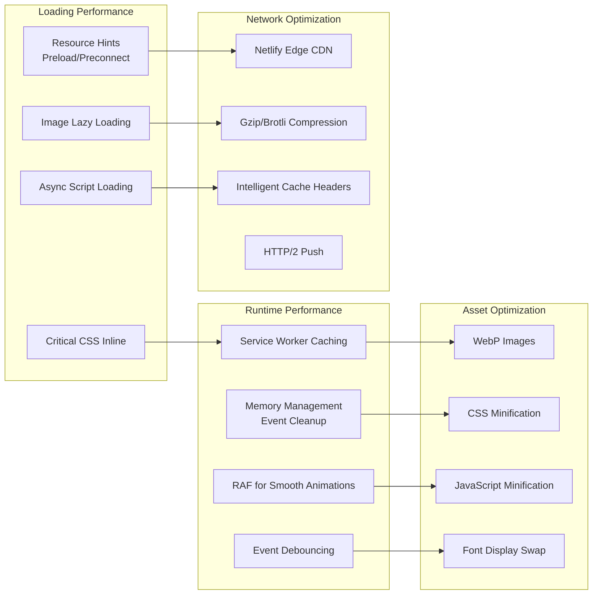

---

## 🚀 Deployment Pipeline

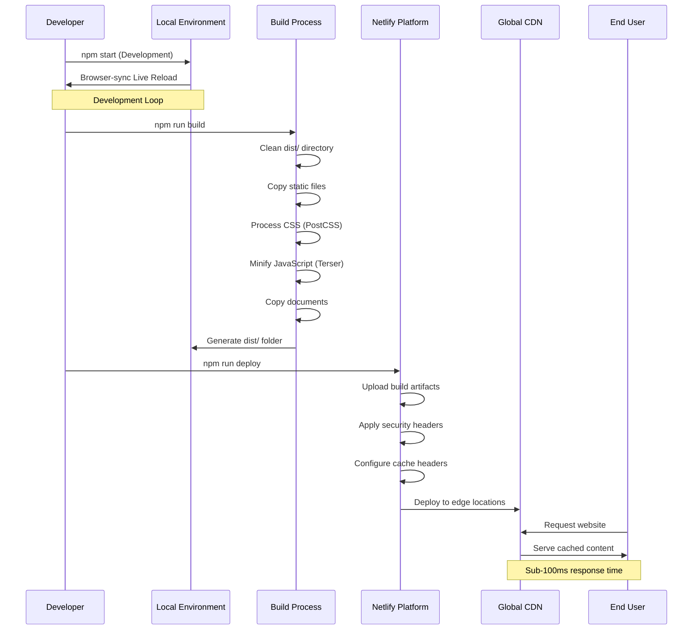

---

## 📱 Progressive Web App Implementation

```mermaid
graph TD
    subgraph "PWA Core Features"
        WebManifest[Web App Manifest]
        ServiceWorker[Service Worker]
        OfflineFirst[Offline-First Strategy]
    end
    
    subgraph "Manifest Configuration"
        AppName[App Name & Short Name]
        Icons[Maskable Icons 192x192, 512x512]
        Display[Standalone Display Mode]
        ThemeColor[Theme Color Matching]
        StartURL[Start URL Configuration]
    end
    
    subgraph "Service Worker Strategy"
        CacheFirst[Cache First for Assets]
        NetworkFirst[Network First for HTML]
        StaleWhileRevalidate[Stale While Revalidate for CSS/JS]
        OfflineFallback[Offline Fallback Page]
    end
    
    subgraph "Installation & Engagement"
        InstallPrompt[Install Banner]
        HomeScreenIcon[Home Screen Icon]
        SplashScreen[Splash Screen]
        FullscreenMode[Fullscreen Mode]
    end
    
    WebManifest --> AppName
    WebManifest --> Icons
    WebManifest --> Display
    WebManifest --> ThemeColor
    
    ServiceWorker --> CacheFirst
    ServiceWorker --> NetworkFirst
    ServiceWorker --> StaleWhileRevalidate
    ServiceWorker --> OfflineFallback
    
    OfflineFirst --> InstallPrompt
    OfflineFirst --> HomeScreenIcon
    OfflineFirst --> SplashScreen
    OfflineFirst --> FullscreenMode
```

---

## 🧪 Development Workflow

### Getting Started

```bash
# Install dependencies
pnpm install

# Start development server
npm start

# Build for production
npm run build

# Deploy to Netlify
npm run deploy
```

### Development Scripts Analysis

| Script | Purpose | Tools Used |
|--------|---------|------------|
| `start` | Development server with live reload | Browser-sync |
| `build` | Complete production build pipeline | Multiple tools |
| `optimize:css` | CSS processing and minification | PostCSS, CSSNano |
| `optimize:js` | JavaScript minification | Terser |
| `copy:documents` | Static document copying | copyfiles |
| `copy:static` | Static asset management | copyfiles |
| `deploy` | Build and deploy to Netlify | Netlify CLI |

### File Watching Strategy

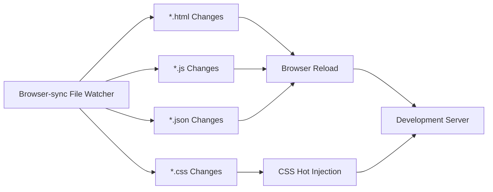

---

## 📈 Performance Metrics & Monitoring

### Core Web Vitals Targets

| Metric | Target | Implementation |
|--------|---------|----------------|
| **LCP** | < 2.5s | Image optimization, critical resource preloading |
| **FID** | < 100ms | Minimal JavaScript, event delegation |
| **CLS** | < 0.1 | Reserved space for images, stable layouts |
| **TTFB** | < 600ms | CDN delivery, service worker caching |

### Monitoring Strategy

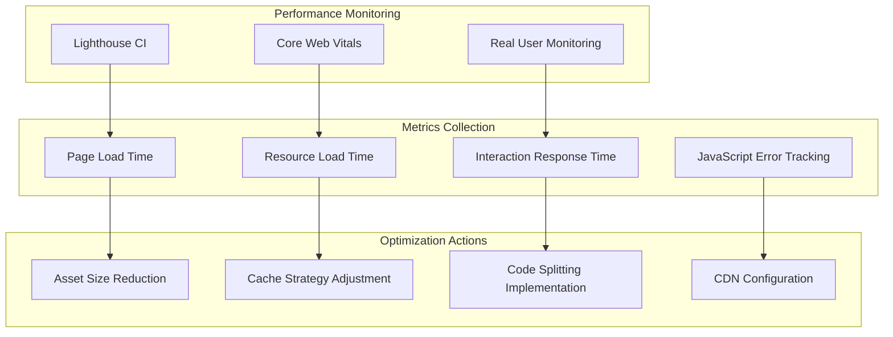

---

## 🔧 Maintenance & Updates

### Update Strategy

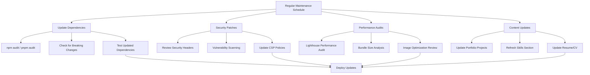

---

## 🎯 Best Practices Demonstrated

### 1. **Performance Excellence**
- **Critical Resource Prioritization**: Preloading fonts and critical CSS
- **Efficient Caching Strategy**: Service worker with cache-first approach
- **Image Optimization**: WebP format with lazy loading
- **Bundle Optimization**: Tree shaking and minification

### 2. **Accessibility Leadership**
- **Semantic HTML**: Proper heading hierarchy and landmark elements
- **ARIA Implementation**: Labels, states, and live regions
- **Keyboard Navigation**: Full keyboard accessibility
- **Screen Reader Support**: Descriptive alt text and announcements

### 3. **Security Hardening**
- **Content Security Policy**: Strict CSP preventing XSS attacks
- **Security Headers**: Comprehensive HTTP security headers
- **Input Validation**: Client-side form validation and sanitization
- **HTTPS Enforcement**: Secure communication protocols

### 4. **SEO Optimization**
- **Meta Tag Strategy**: Complete Open Graph and Twitter Card implementation
- **Structured Data**: Schema.org markup for better search understanding
- **Technical SEO**: Sitemap, robots.txt, and canonical URLs
- **Core Web Vitals**: Optimized for Google's ranking factors

---

## 🏆 Architecture Achievements

This portfolio demonstrates several sophisticated architectural decisions:

1. **Vanilla Technology Mastery**: Proving that modern web applications don't always require frameworks
2. **Build Pipeline Sophistication**: Enterprise-level build process for a static site
3. **Progressive Enhancement**: Graceful degradation with progressive feature enhancement
4. **Performance-First Design**: Every decision optimized for speed and user experience
5. **Accessibility-Driven Development**: Universal design principles throughout
6. **Security-Conscious Implementation**: Production-ready security measures
7. **Maintainable Architecture**: Organized code structure for long-term maintenance

---

## 📚 Conclusion

This portfolio website exemplifies how vanilla web technologies, when architected thoughtfully with modern tooling and best practices, can create sophisticated, performant, and maintainable web applications. The project serves as a blueprint for modern static site development, demonstrating that simplicity and sophistication are not mutually exclusive.

The combination of semantic HTML, systematically organized CSS, and purposeful JavaScript, enhanced by a robust build pipeline and deployment strategy, creates a website that excels in performance, accessibility, security, and user experience while remaining maintainable and scalable.

---

*This documentation serves as both technical reference and demonstration of modern web development practices. The architecture decisions made in this project can be applied to larger-scale applications and serve as a foundation for team development standards.*