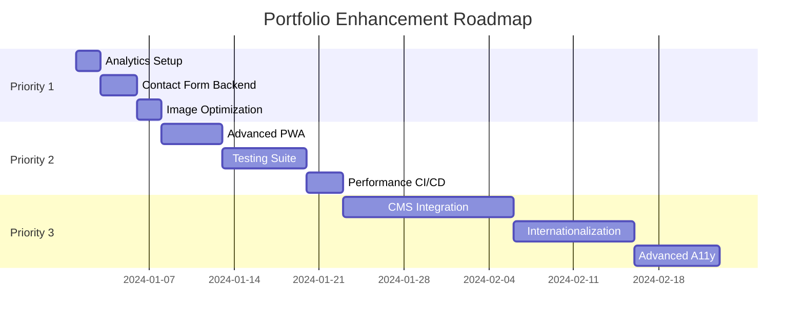

# Portfolio Project - Strategic Improvement Recommendations

## 🎯 Executive Summary

Your portfolio already demonstrates exceptional architecture and implementation quality. These recommendations focus on **strategic enhancements** that will provide measurable value while maintaining the project's elegant simplicity.

---

## 🚀 Priority 1: Immediate Wins (High Impact, Low Effort)

### 1. **Analytics & Performance Monitoring**

**Current State**: No visitor analytics or real-world performance data
**Recommendation**: Implement privacy-focused analytics and Core Web Vitals monitoring

```javascript
// Add to head section - Lightweight analytics
<script>
  // Privacy-focused analytics (Plausible or similar)
  window.plausible = window.plausible || function() { 
    (window.plausible.q = window.plausible.q || []).push(arguments) 
  }
</script>

// Core Web Vitals monitoring
import { getCLS, getFID, getFCP, getLCP, getTTFB } from 'web-vitals';

function sendToAnalytics(metric) {
  // Send to your analytics service
  if (window.plausible) {
    window.plausible('Web Vitals', {
      props: {
        metric_name: metric.name,
        metric_value: metric.value,
        metric_rating: metric.rating
      }
    });
  }
}

getCLS(sendToAnalytics);
getFID(sendToAnalytics);
getFCP(sendToAnalytics);
getLCP(sendToAnalytics);
getTTFB(sendToAnalytics);
```

**Benefits**: Real user data, performance insights, conversion tracking
**Effort**: 2-4 hours

### 2. **Contact Form Backend Integration**

**Current State**: Simulated form submission
**Recommendation**: Integrate with Netlify Forms or serverless function

```html
<!-- Enhanced contact form with Netlify Forms -->
<form name="contact" method="POST" data-netlify="true" data-netlify-honeypot="bot-field">
  <input type="hidden" name="form-name" value="contact" />
  <p class="sr-only">
    <label>Don't fill this out if you're human: <input name="bot-field" /></label>
  </p>
  <!-- existing form fields -->
</form>
```

```javascript
// Enhanced form handling with better UX
async function handleContactFormSubmit(e) {
  e.preventDefault();
  
  const formData = new FormData(e.target);
  const submitButton = e.target.querySelector('button[type="submit"]');
  
  // Enhanced loading state
  submitButton.innerHTML = `
    <span class="loading-spinner" aria-hidden="true"></span>
    Envoi en cours...
  `;
  
  try {
    const response = await fetch('/', {
      method: 'POST',
      headers: { "Content-Type": "application/x-www-form-urlencoded" },
      body: new URLSearchParams(formData).toString()
    });
    
    if (response.ok) {
      showNotification('Message envoyé avec succès !', 'success');
      e.target.reset();
      
      // Track successful submission
      if (window.plausible) {
        window.plausible('Contact Form', { props: { status: 'success' } });
      }
    } else {
      throw new Error('Network response was not ok');
    }
  } catch (error) {
    showNotification('Erreur lors de l\'envoi. Veuillez réessayer.', 'error');
    if (window.plausible) {
      window.plausible('Contact Form', { props: { status: 'error' } });
    }
  } finally {
    submitButton.innerHTML = 'Envoyer le message';
    submitButton.disabled = false;
  }
}
```

**Benefits**: Functional contact form, lead generation, user engagement
**Effort**: 3-5 hours

### 3. **Automated Image Optimization**

**Current State**: Manual image optimization
**Recommendation**: Automated WebP generation with fallbacks

```json
// package.json additions
{
  "devDependencies": {
    "imagemin": "^8.0.1",
    "imagemin-webp": "^7.0.0",
    "imagemin-mozjpeg": "^10.0.0"
  },
  "scripts": {
    "optimize:images": "node scripts/optimize-images.js"
  }
}
```

```javascript
// scripts/optimize-images.js
const imagemin = require('imagemin');
const imageminWebP = require('imagemin-webp');
const imageminMozjpeg = require('imagemin-mozjpeg');

(async () => {
  await imagemin(['assets/img/*.{jpg,png}'], {
    destination: 'assets/img/optimized',
    plugins: [
      imageminWebP({ quality: 80 }),
      imageminMozjpeg({ quality: 85 })
    ]
  });
  console.log('Images optimized!');
})();
```

**Benefits**: Smaller bundle sizes, faster loading, automated workflow
**Effort**: 2-3 hours

---

## 🎯 Priority 2: Strategic Enhancements (High Impact, Medium Effort)

### 4. **Advanced PWA Features**

**Current State**: Basic PWA with service worker
**Recommendation**: Add background sync and push notifications

```javascript
// Enhanced service worker with background sync
self.addEventListener('sync', event => {
  if (event.tag === 'contact-form-sync') {
    event.waitUntil(syncContactForm());
  }
});

async function syncContactForm() {
  try {
    const requests = await getStoredRequests();
    await Promise.all(requests.map(sendRequest));
    await clearStoredRequests();
  } catch (error) {
    console.error('Background sync failed:', error);
  }
}

// Push notification capability
self.addEventListener('push', event => {
  const options = {
    body: event.data.text(),
    icon: '/assets/favicon/favicon-96x96.png',
    badge: '/assets/favicon/favicon-96x96.png',
    actions: [
      { action: 'view', title: 'Voir le portfolio' },
      { action: 'close', title: 'Fermer' }
    ]
  };
  
  event.waitUntil(
    self.registration.showNotification('Portfolio de Yohann', options)
  );
});
```

**Benefits**: Offline form submission, engagement notifications, app-like experience
**Effort**: 8-12 hours

### 5. **Automated Testing Suite**

**Current State**: No automated testing
**Recommendation**: Comprehensive testing with Playwright and Jest

```javascript
// tests/e2e/portfolio.spec.js
const { test, expect } = require('@playwright/test');

test.describe('Portfolio Functionality', () => {
  test('should have working navigation', async ({ page }) => {
    await page.goto('/');
    
    // Test smooth scrolling navigation
    await page.click('a[href="#about"]');
    await page.waitForTimeout(1000); // Wait for smooth scroll
    
    const aboutSection = page.locator('#about');
    await expect(aboutSection).toBeInViewport();
  });
  
  test('should switch themes correctly', async ({ page }) => {
    await page.goto('/');
    
    // Test theme toggle
    await page.click('#theme-toggle');
    await expect(page.locator('body')).toHaveAttribute('data-theme', 'dark');
    
    // Verify persistence
    await page.reload();
    await expect(page.locator('body')).toHaveAttribute('data-theme', 'dark');
  });
  
  test('should be accessible', async ({ page }) => {
    await page.goto('/');
    
    // Test keyboard navigation
    await page.keyboard.press('Tab');
    await expect(page.locator('.nav-link:first-child')).toBeFocused();
    
    // Test ARIA attributes
    const menuToggle = page.locator('#menu-toggle');
    await expect(menuToggle).toHaveAttribute('aria-expanded', 'false');
  });
});

// tests/performance/lighthouse.spec.js
test('should meet performance benchmarks', async ({ page }) => {
  await page.goto('/');
  
  const metrics = await page.evaluate(() => {
    return new Promise((resolve) => {
      new PerformanceObserver((list) => {
        const entries = list.getEntries();
        resolve(entries.map(entry => ({
          name: entry.name,
          value: entry.value,
          rating: entry.rating
        })));
      }).observe({ type: 'largest-contentful-paint', buffered: true });
    });
  });
  
  const lcp = metrics.find(m => m.name === 'LCP');
  expect(lcp.value).toBeLessThan(2500); // LCP < 2.5s
});
```

**Benefits**: Quality assurance, regression prevention, confidence in deployments
**Effort**: 12-16 hours

### 6. **Performance Budget & CI/CD**

**Current State**: Manual performance monitoring
**Recommendation**: Automated performance budgets with GitHub Actions

```yaml
# .github/workflows/performance.yml
name: Performance Budget
on: [push, pull_request]

jobs:
  lighthouse:
    runs-on: ubuntu-latest
    steps:
      - uses: actions/checkout@v3
      - uses: actions/setup-node@v3
        with:
          node-version: '18'
          cache: 'pnpm'
      
      - run: pnpm install
      - run: pnpm run build
      
      - name: Lighthouse CI
        uses: treosh/lighthouse-ci-action@v9
        with:
          configPath: './lighthouserc.json'
          uploadArtifacts: true
          temporaryPublicStorage: true
```

```json
// lighthouserc.json
{
  "ci": {
    "collect": {
      "staticDistDir": "./dist",
      "numberOfRuns": 3
    },
    "assert": {
      "assertions": {
        "categories:performance": ["error", {"minScore": 0.9}],
        "categories:accessibility": ["error", {"minScore": 0.95}],
        "categories:best-practices": ["error", {"minScore": 0.9}],
        "categories:seo": ["error", {"minScore": 0.95}]
      }
    },
    "upload": {
      "target": "temporary-public-storage"
    }
  }
}
```

**Benefits**: Automated quality gates, performance regression prevention, team accountability
**Effort**: 6-8 hours

---

## 🔮 Priority 3: Future Considerations (Strategic Long-term)

### 7. **Content Management System**

**Recommendation**: Headless CMS integration for dynamic content updates

```javascript
// Potential integration with Strapi, Contentful, or Sanity
// For projects section dynamic updates
const projectsEndpoint = 'https://api.contentful.com/spaces/YOUR_SPACE/entries';

async function loadProjects() {
  try {
    const response = await fetch(`${projectsEndpoint}?content_type=project`);
    const data = await response.json();
    renderProjects(data.items);
  } catch (error) {
    console.error('Failed to load projects:', error);
    // Fallback to static content
  }
}
```

**Benefits**: Easy content updates, scalability, non-technical updates
**Effort**: 20-30 hours

### 8. **Internationalization (i18n)**

**Recommendation**: Multi-language support for broader reach

```javascript
// i18n implementation
const translations = {
  fr: {
    'nav.home': 'Accueil',
    'nav.about': 'À propos',
    'nav.projects': 'Projets',
    'nav.contact': 'Contact'
  },
  en: {
    'nav.home': 'Home',
    'nav.about': 'About',
    'nav.projects': 'Projects',
    'nav.contact': 'Contact'
  }
};

function t(key, lang = getUserLanguage()) {
  return translations[lang]?.[key] || key;
}
```

**Benefits**: Global reach, accessibility, professional presentation
**Effort**: 15-25 hours

### 9. **Advanced Accessibility Features**

**Recommendation**: Cutting-edge accessibility enhancements

```javascript
// Voice navigation support
if ('SpeechRecognition' in window || 'webkitSpeechRecognition' in window) {
  const recognition = new (window.SpeechRecognition || window.webkitSpeechRecognition)();
  recognition.continuous = false;
  recognition.lang = 'fr-FR';
  
  recognition.onresult = (event) => {
    const command = event.results[0][0].transcript.toLowerCase();
    
    if (command.includes('accueil')) {
      document.querySelector('a[href="#home"]').click();
    } else if (command.includes('projets')) {
      document.querySelector('a[href="#projects"]').click();
    }
    // Add more voice commands
  };
}

// Enhanced focus management with skip links
function addSkipLinks() {
  const skipLink = document.createElement('a');
  skipLink.href = '#main-content';
  skipLink.textContent = 'Aller au contenu principal';
  skipLink.className = 'skip-link';
  document.body.insertBefore(skipLink, document.body.firstChild);
}
```

**Benefits**: Cutting-edge accessibility, voice control, enhanced UX
**Effort**: 10-15 hours

---

## 📊 Implementation Roadmap



---

## 🎯 Specific Code Improvements

### CSS Enhancements

```css
/* Add modern CSS features */
:root {
  /* Fluid typography */
  --font-size-fluid: clamp(1rem, 2.5vw, 1.25rem);
  
  /* Container queries support */
  container-type: inline-size;
}

/* Enhanced animations with reduce motion */
@media (prefers-reduced-motion: no-preference) {
  .animate-on-scroll {
    animation: fadeInUp 0.6s ease-out forwards;
  }
}

@media (prefers-reduced-motion: reduce) {
  .animate-on-scroll {
    animation: none;
  }
}

/* Modern CSS Grid enhancements */
.projects-grid {
  display: grid;
  grid-template-columns: repeat(auto-fit, minmax(300px, 1fr));
  gap: 2rem;
  container-type: inline-size;
}

@container (min-width: 500px) {
  .project-card {
    /* Enhanced styling for larger containers */
  }
}
```

### JavaScript Modernization

```javascript
// Enhanced intersection observer with root margin
const observerOptions = {
  root: null,
  rootMargin: '0px 0px -100px 0px',
  threshold: [0, 0.25, 0.5, 0.75, 1]
};

// Implement progressive enhancement for new APIs
if ('ViewTransition' in window) {
  // Use View Transitions API for smoother theme switching
  function transitionTheme(newTheme) {
    document.startViewTransition(() => {
      updateTheme(newTheme);
    });
  }
}

// Enhanced error boundary
window.addEventListener('unhandledrejection', event => {
  console.error('Unhandled promise rejection:', event.reason);
  
  // Send to error tracking service
  if (window.plausible) {
    window.plausible('JavaScript Error', {
      props: {
        error: event.reason.toString(),
        stack: event.reason.stack
      }
    });
  }
});
```

---

## 🎖️ Quality Metrics Targets

### Performance Benchmarks
- **Lighthouse Score**: 95+ across all categories
- **Core Web Vitals**: Green for all metrics
- **Bundle Size**: < 50KB compressed
- **Time to Interactive**: < 2 seconds

### Accessibility Standards
- **WCAG 2.1 AAA**: Where feasible
- **Automated Testing**: 100% pass rate
- **Manual Testing**: Regular screen reader testing

### Security Hardening
- **Security Headers**: A+ on securityheaders.com
- **Vulnerability Scanning**: Zero high/critical issues
- **Dependency Updates**: Monthly automated updates

---

## 💡 Next Steps Recommendation

**Start with Priority 1 items** for immediate impact:
1. Implement analytics (2-4 hours)
2. Set up functional contact form (3-5 hours)  
3. Automate image optimization (2-3 hours)

This will provide:
- ✅ Real user insights
- ✅ Functional lead generation
- ✅ Automated performance optimization
- ✅ Measurable improvements

**Total initial investment**: ~10 hours for significant quality and functionality improvements.

Your portfolio is already exceptional - these enhancements will make it truly world-class while maintaining its elegant simplicity and performance excellence. 