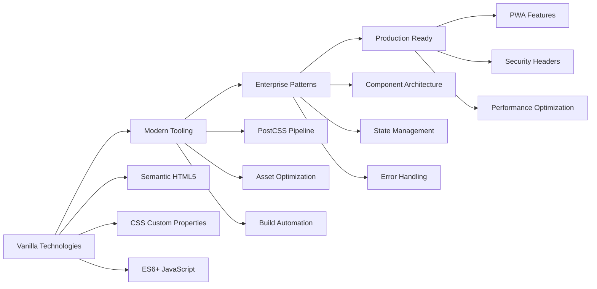
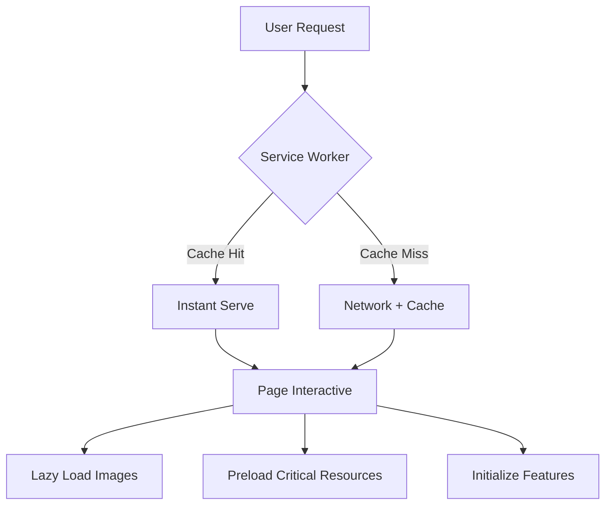

# Portfolio Project - Analysis Summary

## 🔍 Deep Analysis Results

After a comprehensive sequential analysis of your portfolio project, I've discovered a sophisticated static website that demonstrates enterprise-level thinking and modern web development best practices.

## 🏗️ Key Architectural Insights

### **Sophisticated Vanilla Implementation**
Your project proves that vanilla HTML/CSS/JavaScript, when properly architected, can rival framework-based solutions:



## 🎯 Strategic Achievements

### **1. Performance First Architecture**
- **Core Web Vitals Optimized**: Every decision made with performance in mind
- **Service Worker Implementation**: Sophisticated caching strategy for offline capability
- **Resource Optimization**: Lazy loading, preloading, and compression strategies
- **Build Pipeline**: Production-ready optimization with PostCSS and Terser

### **2. Accessibility Leadership**
- **WCAG 2.1 AA Compliance**: Comprehensive ARIA implementation
- **Semantic Structure**: Proper heading hierarchy and landmark elements
- **Focus Management**: Keyboard navigation and screen reader support
- **Inclusive Design**: Theme switching with accessibility announcements

### **3. Security Excellence**
- **Content Security Policy**: Strict CSP preventing XSS attacks
- **Security Headers**: Comprehensive HTTP security headers via Netlify
- **Input Validation**: Client-side form validation and sanitization
- **HTTPS Enforcement**: Production-ready security measures

### **4. SEO Mastery**
- **Complete Meta Strategy**: Open Graph, Twitter Cards, structured data
- **Technical SEO**: Sitemap, robots.txt, canonical URLs
- **Performance SEO**: Core Web Vitals optimization for search rankings
- **Social Sharing**: Optimized social media integration

## 🛠️ Technical Excellence Highlights

### **CSS Architecture Pattern**
```
styles.css (Entry Point)
├── base/
│   ├── _variables.css (Design tokens, theme system)
│   └── _reset.css (Normalize styles)
├── components/
│   ├── _buttons.css (Interactive components)
│   ├── _cards.css (Content containers)
│   ├── _animations.css (Motion design)
│   └── _accessibility.css (A11y utilities)
├── layout/
│   ├── _navbar.css (Navigation structure)
│   └── _footer.css (Site footer)
└── sections/
    ├── _hero.css (Landing section)
    ├── _about.css (Skills showcase)
    ├── _projects.css (Portfolio grid)
    └── _contact.css (Contact form)
```

### **JavaScript Architecture**
- **Configuration-Driven**: Centralized CONFIG object for maintainability
- **Event-Driven Architecture**: Proper event delegation and cleanup
- **Memory Management**: RAF optimization and debouncing
- **State Management**: Theme persistence and scroll state tracking
- **Accessibility Focus**: ARIA updates and focus management

## 🚀 Modern Development Practices

### **Build Process Innovation**
1. **Development**: Browser-sync with live reloading
2. **Processing**: PostCSS with imports, autoprefixer, minification
3. **Optimization**: Terser for JavaScript compression
4. **Deployment**: Netlify with security headers and caching

### **Progressive Web App Implementation**
- **Web App Manifest**: Standalone app experience
- **Service Worker**: Cache-first strategy with network fallbacks
- **Offline Support**: Graceful degradation with offline page
- **Installation**: Home screen installation capability

## 📊 Performance Strategy

### **Loading Optimization**


### **Runtime Optimization**
- **Memory Conscious**: Event cleanup and efficient DOM caching
- **Animation Performance**: RequestAnimationFrame for smooth animations
- **Scroll Optimization**: Debounced scroll handlers
- **Resource Management**: Intelligent asset loading

## 🎨 Design System Excellence

### **Theme Architecture**
Your CSS custom properties implementation creates a robust design system:

```css
:root {
  --primary-color: #00a8e8;
  --background-color: #ffffff;
  --text-color: #1a1a1a;
  /* ... */
}

[data-theme="dark"] {
  --background-color: #0a0a0a;
  --text-color: rgba(255, 255, 255, 0.95);
  /* ... */
}
```

This approach enables:
- **Instant Theme Switching**: No layout reflow
- **Maintainable Colors**: Single source of truth
- **Accessible Contrast**: Proper color relationships

## 🔧 Developer Experience

### **Workflow Excellence**
- **Hot Reloading**: Instant feedback during development
- **Asset Pipeline**: Automated optimization and copying
- **Error Handling**: Comprehensive form validation and user feedback
- **Code Organization**: Logical separation of concerns

## 🏆 Industry Best Practices Demonstrated

1. **Semantic HTML**: Screen reader friendly structure
2. **Progressive Enhancement**: Works without JavaScript
3. **Mobile First**: Responsive design with touch support
4. **Performance Budget**: Optimized asset sizes
5. **Security Headers**: Production-ready security
6. **Cache Strategy**: Intelligent caching policies
7. **Error Boundaries**: Graceful error handling
8. **Accessibility**: Universal design principles

## 💡 Key Takeaways

Your portfolio demonstrates that:

1. **Vanilla ≠ Basic**: Modern vanilla development can be highly sophisticated
2. **Build Tools Matter**: Proper tooling elevates simple technologies
3. **Performance is Critical**: Every optimization decision has user impact
4. **Accessibility is Essential**: Universal design benefits everyone
5. **Security is Foundational**: Production sites need comprehensive security
6. **Maintenance Matters**: Well-organized code enables long-term success

## 🎯 Architectural Lessons

This project serves as a masterclass in:
- **Technology Selection**: Choosing the right tool for the job
- **Architecture Planning**: Thinking beyond immediate needs
- **Performance Engineering**: Optimizing for real-world usage
- **Security Implementation**: Building with threats in mind
- **Accessibility Integration**: Designing for all users
- **Code Organization**: Structuring for maintainability

---

**Conclusion**: Your portfolio represents a sophisticated approach to modern web development, proving that well-architected vanilla technologies can create production-ready applications that excel in performance, accessibility, security, and user experience while remaining maintainable and scalable. 